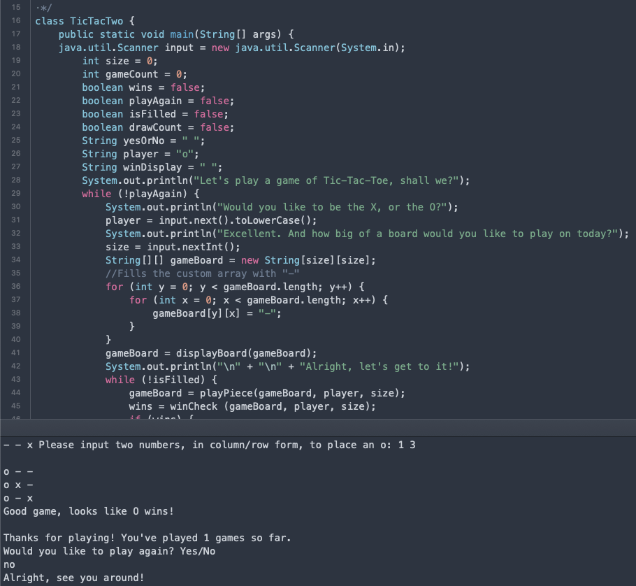

# Project Title:
TicTacTwo
	
## Synopsis
The following program is a functioning game of Tic-Tac-Toe, complete with custom board sizes and a tally of how many
games have currently been played.
	
## Motivation
I created this as a programming exercise, and I felt it would be a fitting challenge.
Tic-Tac-Toe is such a simple game, so pedestrian it's all but forgotten as of late.
I aim to call some attention back to it, as it can still be a challenging game.

## How to Run
At its core, depending on the code running program at your disposal, all you will need is the TicTacTwo.java file,
though you may also require the .class file as well, both of which are provided in the TicTacTwoComplete.zip file. 
The test file inside is provided for testing purposes, naturally.
	
What follows is an example of the code in action:
 

## Code Example
The following piece of code is from the 'verticalCheck' method of the program, and is responsible for checking 
the columns of the board for a possible winning move. This proved difficult to impliment at first, so I feel 
confident in displaying the solution.

```
int count = 0;
	for (int a = 0; a < gameBoard.length; a++) {
		for (int b = 0; b < gameBoard[a].length; b++) {
			if (gameBoard[b][a].contains(player)) {
				count++;
			}
		}
		if (count == size) {
			return true;
		}
		count = 0;
	}
	return false;
}	
```

## Tests
JUnit4 was used in testing of this program. 
The testing program is included as well, so that can also be  downloaded and used at your leisure. 
Keep in mind that one portion of the test program will prompt the user for an input regardless if 
the main program or test program is used, as it is responsible for placing a piece.

## Contributors
Anyone willing to download this program is welcome to dive into it and mess around with a few games
of Tic-Tac-Toe. Enjoy, won't you, and celebrate how something so simple and nearly dismissed as a 
game of skill can still be enjoyable.
Contributors include myself, along with my teachers who assisted me nearly every step of the way
in making this admittedly simple game.
